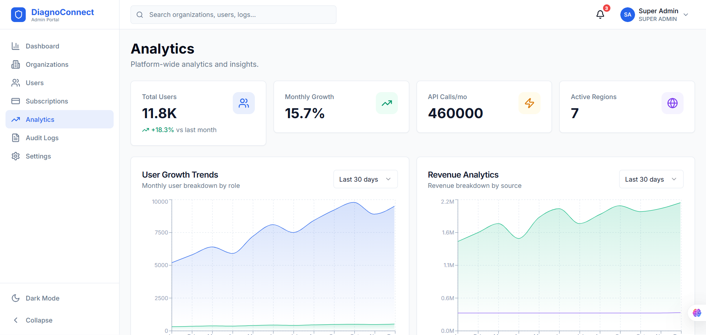
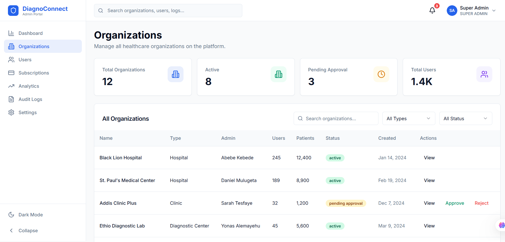
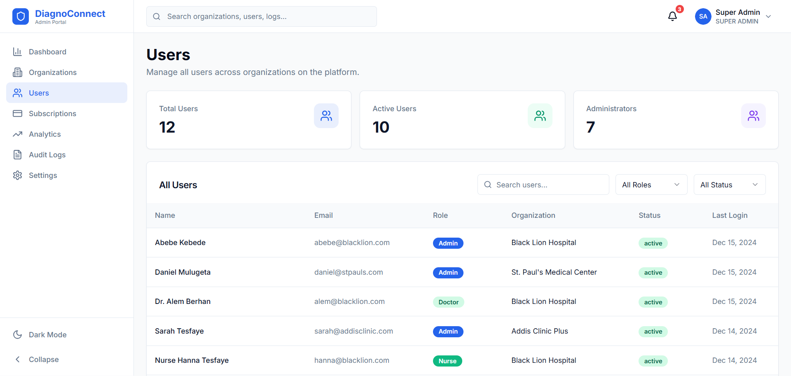
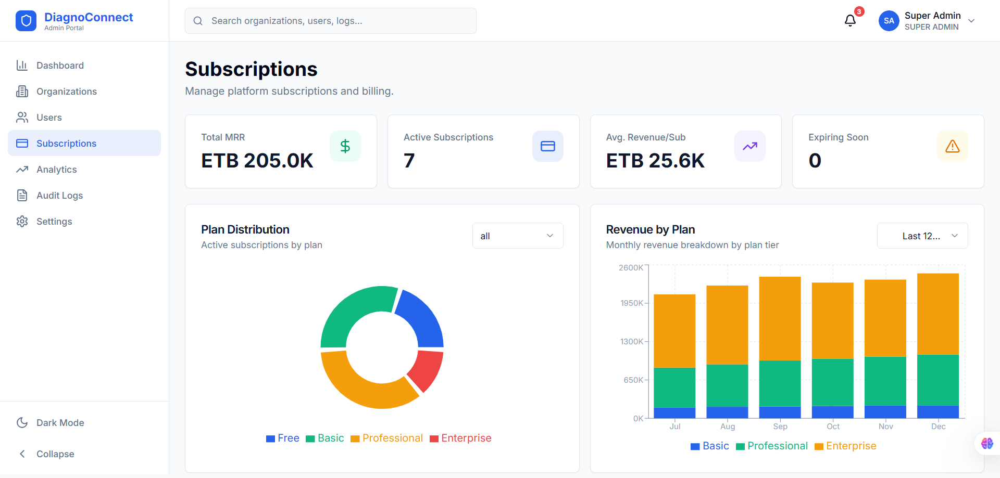
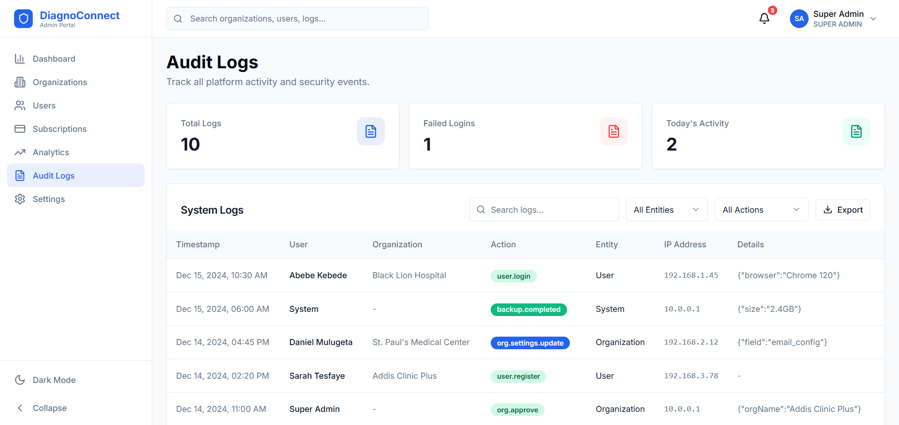

<div align="center">

<!-- Replace with actual logo file -->
<!--  -->

# DiagnoConnect

### Connecting Patients, Hospitals, Doctors & Diagnostic Centers on One Intelligent Platform

[](https://github.com/your-org/diagnosconnect/actions/workflows/ci.yml)
[](#license)
[](https://nodejs.org)
[](https://www.typescriptlang.org)
[](https://www.docker.com)

DiagnoConnect is a production-ready, enterprise-grade **Healthcare SaaS platform** that digitally connects patients, hospitals, clinics, diagnostic centers, pharmacies, doctors, and insurance companies into one integrated ecosystem.

</div>

---

## Screenshots

<div align="center">

### Super Admin Dashboard



</div>

---

## Key Features

<table>
<tr>
<td width="50%">

#### Multi-Tenant SaaS
- Unlimited organizations with complete data isolation
- Subscription plans: Free, Basic, Professional, Enterprise
- Organization-specific branding and configuration
- 9 organization types supported (Hospitals, Clinics, Labs, etc.)

#### Real-Time Operations
- Live queue management with priority scoring
- Real-time chat and notifications via WebSocket
- Instant lab result delivery to physicians
- Live appointment availability updates

</td>
<td width="50%">

#### Telemedicine
- Video/Audio calls with screen sharing
- Remote consultations with EMR access
- Secure, HIPAA-inspired video sessions

#### Intelligent Workflow
- Automated patient flow: Registration > Queue > Doctor > Lab/Radiology > Pharmacy > Billing
- Clinical Decision Support for physicians
- Automated prescription-to-pharmacy routing

</td>
</tr>
</table>

---

## Platform Portals

| Portal | Technology | Description | URL |
|--------|-----------|-------------|-----|
| **Patient Portal** | React 18 + Vite + TailwindCSS + ShadCN UI | Patient-facing web app for appointments, records, prescriptions, billing, chat | `http://localhost:5173` |
| **Admin Dashboard** | React 18 + Vite + Recharts + ShadCN UI | Super-admin web app for managing organizations, users, subscriptions, analytics | `http://localhost:5174` |
| **Reception Desktop** | Electron + React + Vite | Offline-capable desktop app for hospital reception with barcode scanning & printing | `http://localhost:5175` |
| **Mobile App** | React Native + Expo + NativeWind | Cross-platform mobile app for patients (iOS & Android) | Expo Go |
| **Backend API** | Node.js + Express + TypeScript + Prisma | RESTful API with WebSocket support, 24 modules | `http://localhost:3000/api/v1` |

---

## Screenshots Gallery

### Super Admin Dashboard

| Organizations | Users | Subscriptions |
|---------------|-------|---------------|
|  |  |  |

| Analytics | Audit Logs |
|-----------|------------|
|  |  |

---

## Architecture

```
DiagnoConnect
├── packages/
│   ├── backend/              # Node.js + Express + TypeScript + Prisma + PostgreSQL
│   │   ├── src/modules/      # 24 API modules
│   │   ├── prisma/           # Database schema (50+ models)
│   │   └── src/socket/       # WebSocket handlers
│   └── shared/               # Shared types, constants, utilities
│
├── apps/
│   ├── patient-portal/       # React + Vite + TailwindCSS + ShadCN UI
│   ├── admin-dashboard/      # React + Vite + Recharts + ShadCN UI
│   ├── reception-desktop/    # Electron + React (Offline-capable)
│   └── mobile-app/           # React Native + Expo + NativeWind
│
├── nginx/                    # Reverse proxy configuration
├── scripts/                  # Setup, backup, deployment scripts
├── docker-compose.yml        # Full Docker stack (6 services)
└── .github/workflows/        # CI/CD pipeline
```

---

## Tech Stack

| Layer | Technology | Purpose |
|-------|-----------|---------|
| **Backend** | Node.js, Express, TypeScript, Prisma ORM | API server with 24 modular controllers |
| **Database** | PostgreSQL 16, Redis 7 | Persistent storage + caching/sessions |
| **Real-Time** | Socket.IO, WebSocket | Live queues, chat, notifications, video |
| **Patient Portal** | React 18, Vite, TailwindCSS, ShadCN UI, React Query | Patient-facing SPA |
| **Admin Dashboard** | React 18, Vite, Recharts, ShadCN UI, Framer Motion | Admin SPA with analytics |
| **Desktop App** | Electron 33, React, Vite, Zustand | Offline-capable reception |
| **Mobile App** | React Native 0.76, Expo 52, NativeWind, Zustand | Cross-platform mobile |
| **DevOps** | Docker Compose, Nginx, GitHub Actions | Containerization, proxy, CI/CD |
| **Payments** | ArifPay, Chapa, Stripe, PayPal | Multi-gateway payment processing |

---

## Quick Start

### Prerequisites

- **Node.js** 20+
- **PostgreSQL** 16+
- **Redis** 7+
- **Docker & Docker Compose** (recommended)

### Option 1: Docker (Recommended)

```bash
# Clone the repository
git clone https://github.com/your-org/diagnosconnect.git
cd diagnosconnect

# Configure environment
cp .env.example .env

# Start all services (PostgreSQL, Redis, Backend, Portals, Nginx)
docker compose up -d

# Run database migrations
docker compose exec backend npx prisma migrate deploy

# Seed the database with sample data
docker compose exec backend npx tsx src/database/seed.ts
```

Open [http://localhost](http://localhost) in your browser.

### Option 2: Manual Setup

```bash
# 1. Install all dependencies
npm install

# 2. Setup database
cd packages/backend
cp .env.example .env        # Update DATABASE_URL if needed
npx prisma migrate dev       # Run migrations
npx prisma generate          # Generate Prisma client
npx tsx src/database/seed.ts # Seed sample data

# 3. Start the backend (Terminal 1)
npm run dev:backend

# 4. Start the patient portal (Terminal 2)
npm run dev:patient

# 5. Start the admin dashboard (Terminal 3)
npm run dev:admin

# 6. Start the reception desktop (Terminal 4)
cd apps/reception-desktop
npm run dev

# 7. Start the mobile app (Terminal 5)
cd apps/mobile-app
npm start
```

### URLs

| Application | Development URL |
|-------------|----------------|
| Patient Portal | http://localhost:5173 |
| Admin Dashboard | http://localhost:5174 |
| Reception Desktop | http://localhost:5175 |
| Backend API | http://localhost:3000/api/v1 |

---

## Default Credentials

| Role | Email | Password | Portal |
|------|-------|----------|--------|
| Super Admin | `admin@diagnosconnect.com` | `Admin@123` | Admin Dashboard |
| Hospital Admin | `admin@citygeneral.hospital` | `Admin@123` | Admin Dashboard |
| Receptionist | `reception@citygeneral.hospital` | `Admin@123` | Reception Desktop |
| Doctor | `abebe@citygeneral.hospital` | `Admin@123` | Patient Portal |
| Lab Technician | `labtech@citygeneral.hospital` | `Admin@123` | Patient Portal |
| Pharmacist | `pharmacy@citygeneral.hospital` | `Admin@123` | Patient Portal |
| Cashier | `cashier@citygeneral.hospital` | `Admin@123` | Patient Portal |

> **Note:** All accounts use the same password `Admin@123` for demo purposes. Change these in production.

---

## Core Modules

<table>
<tr>
<td>

**Clinical**
- Patient Management & Registration
- Electronic Medical Records (EMR)
- SOAP Notes & Vitals
- Doctor Profiles & Schedules
- Prescription Management
- Telemedicine (Video/Audio)

</td>
<td>

**Diagnostic**
- Laboratory Management
- Test Results & Sample Tracking
- Radiology (X-Ray, CT, MRI)
- Imaging & Report Review
- Clinical Decision Support

</td>
<td>

**Operations**
- Appointment Booking
- Real-Time Queue Management
- Room & Department Management
- Visit Tracking
- Waiting List Management

</td>
<td>

**Business**
- Billing & Invoicing
- Payment Processing (5 gateways)
- Insurance Claims & Settlements
- Pharmacy Inventory
- Subscription Management

</td>
</tr>
</table>

---

## API Documentation

The backend exposes a RESTful API at `/api/v1` with the following endpoint groups:

| Module | Endpoints | Description |
|--------|-----------|-------------|
| **Auth** | `POST /auth/login`, `POST /auth/register`, `POST /auth/refresh-token`, `GET /auth/profile` | JWT authentication with refresh token rotation |
| **Patients** | `GET /patients`, `POST /patients`, `GET /patients/:id`, `PATCH /patients/:id`, `GET /patients/:id/medical-history` | Full patient lifecycle management |
| **Visits** | `GET /visits`, `POST /visits`, `GET /visits/:id`, `PATCH /visits/:id/status` | Visit tracking with status workflow |
| **Appointments** | `GET /appointments`, `POST /appointments`, `PATCH /appointments/:id/cancel`, `POST /appointments/:id/check-in` | Online booking and walk-in management |
| **Queue** | `GET /queue`, `POST /queue/assign`, `PATCH /queue/:id/next` | Real-time queue with priority scoring |
| **EMR** | `POST /emr/soap-notes`, `GET /emr/soap-notes/:visitId`, `POST /emr/vitals` | SOAP notes, vitals, diagnosis |
| **Laboratory** | `GET /lab/tests`, `POST /lab/orders`, `POST /lab/results`, `GET /lab/results/:id` | Test ordering through result delivery |
| **Radiology** | `GET /radiology/requests`, `POST /radiology/reports`, `POST /radiology/upload` | Imaging requests and report management |
| **Pharmacy** | `GET /pharmacy/inventory`, `POST /pharmacy/dispense`, `GET /pharmacy/stock` | Medicine inventory and dispensing |
| **Billing** | `GET /billing/invoices`, `POST /billing/invoices`, `POST /billing/payments`, `GET /billing/reports` | Invoice generation and payment processing |
| **Insurance** | `GET /insurance/providers`, `POST /insurance/claims`, `PATCH /insurance/claims/:id/verify` | Insurance claim lifecycle |
| **Chat** | `GET /chat/rooms`, `POST /chat/messages`, WebSocket `/socket.io` | Real-time messaging |
| **Notifications** | `GET /notifications`, `PATCH /notifications/:id/read` | Multi-channel notifications |
| **Reports** | `GET /reports/analytics`, `GET /reports/revenue`, `GET /reports/patient` | Analytics and reporting |

> Full Swagger documentation available at `http://localhost:3000/api-docs` when the backend is running.

---

## Security

DiagnoConnect follows HIPAA-inspired security practices:

| Feature | Implementation |
|---------|---------------|
| **Authentication** | JWT with Refresh Token Rotation (15min access / 7-day refresh) |
| **Authorization** | Role-Based Access Control (RBAC) with 10+ roles |
| **Data Isolation** | Multi-tenant architecture with organization-scoped queries |
| **Password Security** | bcrypt hashing with 12 salt rounds |
| **Rate Limiting** | API: 10 req/s, Auth: 5 req/min |
| **Security Headers** | Helmet.js (X-Frame-Options, CSP, HSTS, X-XSS-Protection) |
| **Input Validation** | Zod schema validation on all endpoints |
| **SQL Injection** | Prisma ORM parameterized queries |
| **Audit Logging** | Full audit trail for sensitive operations |
| **Encryption** | TLS in transit, encrypted secrets in environment |

---

## Deployment

### Docker Compose (Recommended)

```bash
docker compose up -d
```

**Services:** PostgreSQL, Redis, Backend API, Patient Portal, Admin Dashboard, Nginx Reverse Proxy

### Production Setup Script

```bash
chmod +x scripts/setup.sh
./scripts/setup.sh
```

Automates: Docker check, `.env` generation, secrets generation, database migration, seeding, and service startup.

### Database Backup

```bash
chmod +x scripts/backup.sh
./scripts/backup.sh
```

Creates timestamped, gzip-compressed backups with automatic rotation (keeps last 30).

### CI/CD Pipeline

GitHub Actions workflow (`.github/workflows/ci.yml`) automatically:

1. **Lint & Type Check** — Runs `tsc --noEmit` across all packages
2. **Test** — Executes test suite with PostgreSQL 16 and Redis 7 services
3. **Build** — Builds and pushes Docker images to GitHub Container Registry (GHCR)
4. **Deploy** — SSH deployment to production server with zero-downtime restart

---

## Project Structure

```
packages/backend/src/
├── config/           # Database, Redis, environment configuration
├── middleware/        # Auth (JWT), RBAC, rate limiting, error handling
├── utils/            # Logger (Winston), email (Nodemailer), tokens, audit, helpers
├── modules/
│   ├── auth/         # Authentication & authorization
│   ├── users/        # User management
│   ├── patients/     # Patient registration & records
│   ├── visits/       # Visit tracking
│   ├── appointments/ # Appointment booking
│   ├── queue/        # Real-time queue management
│   ├── doctors/      # Doctor profiles & schedules
│   ├── departments/  # Department management
│   ├── rooms/        # Room management
│   ├── emr/          # Electronic Medical Records (SOAP Notes, Vitals)
│   ├── prescriptions/# Prescription management
│   ├── laboratory/   # Lab tests & results
│   ├── radiology/    # Radiology requests & reports
│   ├── pharmacy/     # Medicine inventory & dispensing
│   ├── billing/      # Invoices & payments
│   ├── insurance/    # Insurance providers & claims
│   ├── payments/     # Payment processing (ArifPay, Chapa, Stripe, PayPal)
│   ├── notifications/# Multi-channel notifications
│   ├── chat/         # Real-time messaging
│   ├── video/        # Telemedicine video/audio sessions
│   ├── reports/      # Analytics & reports
│   ├── files/        # File management
│   ├── settings/     # Organization settings
│   └── organizations/# Multi-tenant organization management
├── socket/           # Socket.IO WebSocket handlers
├── jobs/             # Background tasks (node-cron)
├── database/         # Seed data
└── types/            # TypeScript type definitions
```

---

## Development

```bash
# Run tests
npm test

# Lint all packages
npm run lint

# Type check all packages
npx tsc --noEmit

# Database studio (visual DB browser)
npm run db:studio

# Generate Prisma client
npm run db:generate

# Re-run migrations
npm run db:migrate

# Re-seed database
npm run db:seed
```

---

## Contributing

1. Fork the repository
2. Create a feature branch (`git checkout -b feature/amazing-feature`)
3. Commit your changes (`git commit -m 'Add amazing feature'`)
4. Push to the branch (`git push origin feature/amazing-feature`)
5. Open a Pull Request

Please ensure all lint and type-check passes before submitting:

```bash
npm run lint
npx tsc --noEmit
```

---

## License

Proprietary - All rights reserved.

Unauthorized copying, modification, distribution, or use of this software is strictly prohibited.

---

<div align="center">

**Built with care for healthcare.**


</div>
# Diagnoconnect

